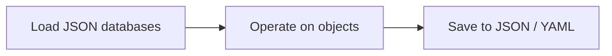

The application uses JSON files as its primary storage backend. The main program flow is: load data from JSON files, operate on the in-memory objects, then save the updated state back to JSON. Both `.json` and `.yaml` output formats are supported.

## Program flow



<Steps>
  <Step title="Load">
    At startup, Food and Recipe data is read from JSON files on disk. `BaseClass.load_from_file()` deserializes each record into the corresponding object and registers it in the class-level instance registry.
  </Step>
  <Step title="Operate">
    The application creates, modifies, and queries Food and Recipe objects in memory. The instance registry provides fast lookup by `id` / `name`.
  </Step>
  <Step title="Save">
    When work is complete, call `save()` to write objects back to disk. The output path determines the format: `.json` produces JSON, `.yaml` produces YAML.
  </Step>
</Steps>

## BaseClass serialization

All objects (Food and Recipe) inherit save/load methods from `BaseClass`.

<AccordionGroup>
  <Accordion title="Saving: object to dict">
    `save(filepath)` converts the object to a dictionary and writes it to the specified file. The filepath extension controls the output format.

    ```python
    food.save("data/foods.json")   # JSON output
    food.save("data/foods.yaml")   # YAML output
    ```
  </Accordion>
  <Accordion title="Loading: dict to object">
    `load_from_file(filepath)` reads the file, parses each record, and reconstructs the objects, re-registering them in the instance registry.

    ```python
    Food.load_from_file("data/foods.json")
    Recipe.load_from_file("data/recipes.json")
    ```
  </Accordion>
  <Accordion title="Extra properties">
    Fields beyond the core schema (such as `comments`, `brand`, or `tags`) are stored as extra properties and round-trip through serialization without data loss.
  </Accordion>
  <Accordion title="Overwrite logging">
    If loading a file includes an object whose `id` already exists in the registry, the old object is replaced and its previous values are logged as an alert.
  </Accordion>
</AccordionGroup>

## File format examples

### Food database

<CodeGroup>

```json foods.json
[
  {
    "id": "egg",
    "price": 3.20,
    "energy": 155,
    "unit": 60,
    "comments": "Medium, free-range"
  },
  {
    "id": "oat_rolled",
    "price": 1.80,
    "energy": 389
  }
]
```

```yaml foods.yaml
- id: egg
  price: 3.20
  energy: 155
  unit: 60
  comments: "Medium, free-range"

- id: oat_rolled
  price: 1.80
  energy: 389
```

</CodeGroup>

### Recipe database

<CodeGroup>

```json recipes.json
[
  {
    "name": "overnight_oats",
    "time": 5,
    "comments": "Prepare the evening before",
    "ingredients": [
      { "food_id": "oat_rolled", "quantity": 80 },
      { "food_id": "egg",        "quantity": "1u" }
    ]
  }
]
```

```yaml recipes.yaml
- name: overnight_oats
  time: 5
  comments: Prepare the evening before
  ingredients:
    - food_id: oat_rolled
      quantity: 80
    - food_id: egg
      quantity: "1u"
```

</CodeGroup>

## Project file layout

<Tree>
  <Tree.Folder name="src" defaultOpen>
    <Tree.File name="settings.py" />
    <Tree.File name="settings.yaml" />
    <Tree.File name="constants.py" />
  </Tree.Folder>
  <Tree.Folder name="data">
    <Tree.File name="foods.json" />
    <Tree.File name="recipes.json" />
  </Tree.Folder>
</Tree>

<Note>
  The `data/` directory location is a convention. You can pass any filepath to `save()` and `load_from_file()`.
</Note>

## Settings system

Application-wide configuration is handled by `src/settings.py`. It loads `src/settings.yaml`, merges it with the built-in defaults, and exposes a single `SETTINGS` dictionary to the rest of the codebase.

### Default settings

```python
default_settings = {
    "template": {
        "property": 40,
    },
    "property": 1
}
```

### User settings file

```yaml
# src/settings.yaml
template:
  property: 0    # int
property: 1
```

### Merge behavior

`merge_dicts` performs a deep merge: user settings override defaults key by key, including nested dicts. Keys present only in the defaults are preserved.

```python
# src/settings.py (simplified)
SETTINGS: dict[str, Any] = merge_dicts(default_settings, user_settings)
```

<Tip>
  Edit `src/settings.yaml` to override any default. You only need to include the keys you want to change; all other defaults remain active.
</Tip>

### Constants derived from settings

`src/constants.py` reads from `SETTINGS` and exposes typed constants used throughout the application:

```python
# src/constants.py
TEMPLATE_PROPERTY: int   = int(SETTINGS["template"]["property"])
PROPERTY: int            = int(SETTINGS["property"])
DERIVATE_PROPERTY: float = float(PROPERTY) / 1000
```

Import these constants directly rather than reading from `SETTINGS` in application code:

```python
from constants import PROPERTY, DERIVATE_PROPERTY
```
