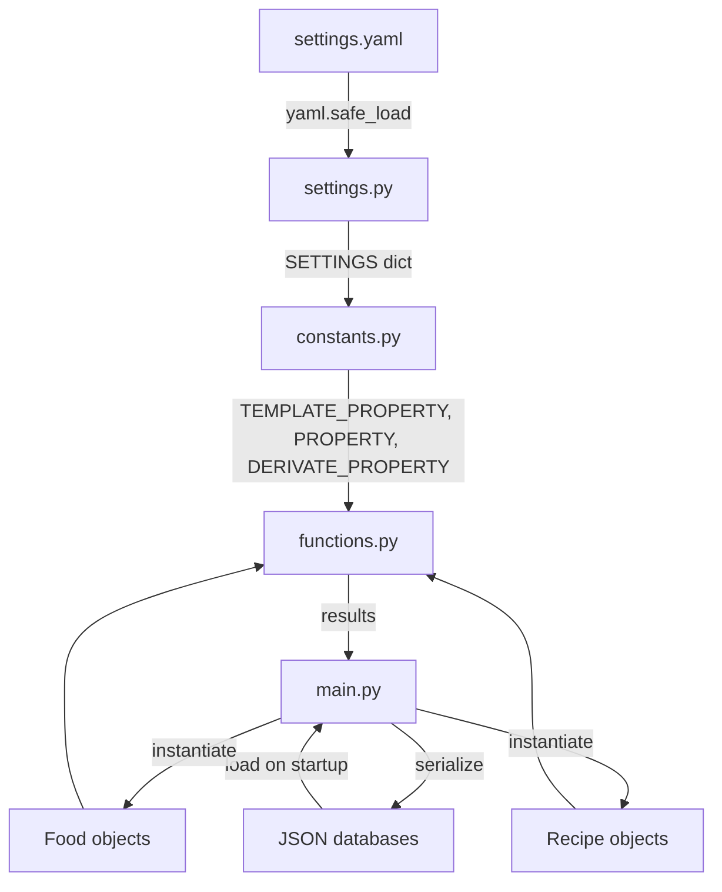
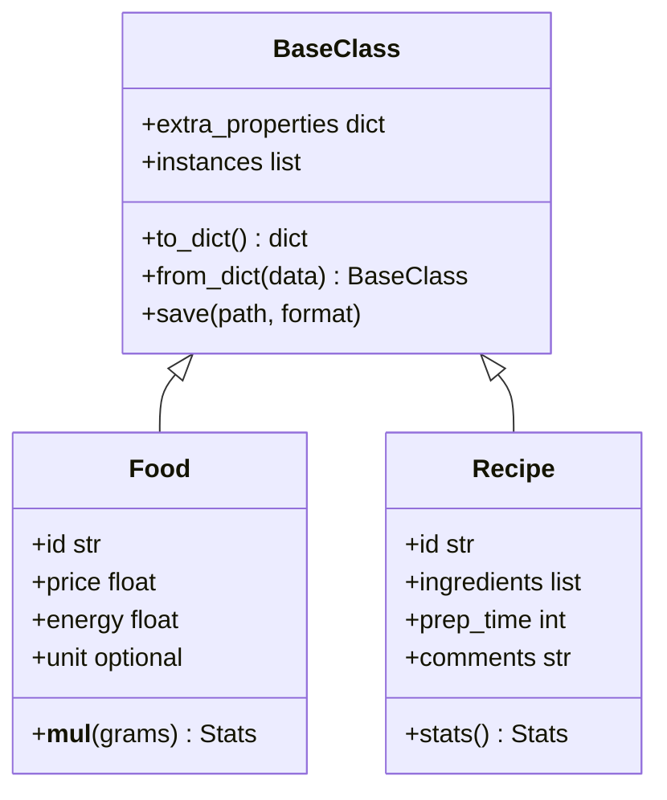

## Program flow

The application follows a simple load-operate-save cycle:

<Steps>
  <Step title="Load">
    On startup, `main.py` reads the food and recipe databases from JSON files on disk and instantiates the corresponding Python objects.
  </Step>
  <Step title="Operate">
    The user interacts with the application through the `customtkinter` GUI. Actions invoke functions from `functions.py`, which operate on the in-memory objects.
  </Step>
  <Step title="Save">
    Modified objects are serialized back to JSON and written to the database files.
  </Step>
</Steps>

## Data flow

## Module structure

<CardGroup cols={2}>
  <Card title="main.py" icon="play">
    Entry point. Initializes the GUI, loads data from JSON databases, wires together modules, and saves data on exit.
  </Card>
  <Card title="functions.py" icon="code">
    Core business logic. Implements the operations exposed to the GUI — searching, computing statistics, and managing food and recipe records.
  </Card>
  <Card title="constants.py" icon="hash">
    Typed constants derived from `SETTINGS`. Imports `TEMPLATE_PROPERTY`, `PROPERTY`, and `DERIVATE_PROPERTY` for use across the codebase.
  </Card>
  <Card title="settings.py" icon="sliders">
    Configuration loading. Reads `src/settings.yaml`, merges with defaults, and exposes the `SETTINGS` dict.
  </Card>
  <Card title="utils/" icon="wrench">
    Utility helpers. Small, reusable functions that are not tied to any specific feature. Imported by other modules as building blocks.
  </Card>
</CardGroup>

### Module file tree

<Tree>
  <Tree.Folder name="src" defaultOpen>
    <Tree.File name="main.py" />
    <Tree.File name="functions.py" />
    <Tree.File name="constants.py" />
    <Tree.File name="settings.py" />
    <Tree.File name="settings.yaml" />
    <Tree.Folder name="utils" defaultOpen>
      <Tree.File name="__init__.py" />
    </Tree.Folder>
  </Tree.Folder>
</Tree>

## Class hierarchy

All domain objects inherit from `BaseClass`. `Food` and `Recipe` extend it with their own properties and methods.

### BaseClass

`BaseClass` is the shared parent for all domain objects. It provides:

- **Extra properties** — arbitrary key-value pairs for comments or custom metadata.
- **Instance registry** — a class-level collection of all instantiated objects.
- **Serialization** — `to_dict` / `from_dict` methods for JSON and YAML persistence.
- **Overwrite logging** — logs an alert (including the previous value) when an existing object is replaced.

### Food

Represents a single food item:

| Property | Type | Description |
|---|---|---|
| `id` | `str` | Unique name for the food |
| `price` | `float` | Price in €/kg |
| `energy` | `float` | Energy in kcal/100g |
| `unit` | optional | Gram quantity one unit represents |

Multiplying a `Food` by a gram amount returns total price and energy. When `unit` is set, multiplication by `"{n}u"` scales by units instead of raw grams.

### Recipe

Represents a collection of foods with quantities:

| Property | Type | Description |
|---|---|---|
| `id` | `str` | Unique recipe name |
| `ingredients` | `list` | Food objects and their quantities |
| `prep_time` | `int` | Preparation time |
| `comments` | `str` | Free-text notes |

The `stats()` method aggregates nutrition and cost from all ingredient `Food` objects.

## Dependencies

| Package | Used in | Purpose |
|---|---|---|
| `pyyaml` | `settings.py` | Parse `settings.yaml` |
| `numpy` | `main.py`, `constants.py` | Numerical operations |
| `icecream` | `main.py`, `settings.py` | Debug logging |
| `customtkinter` | `main.py` | GUI framework |
